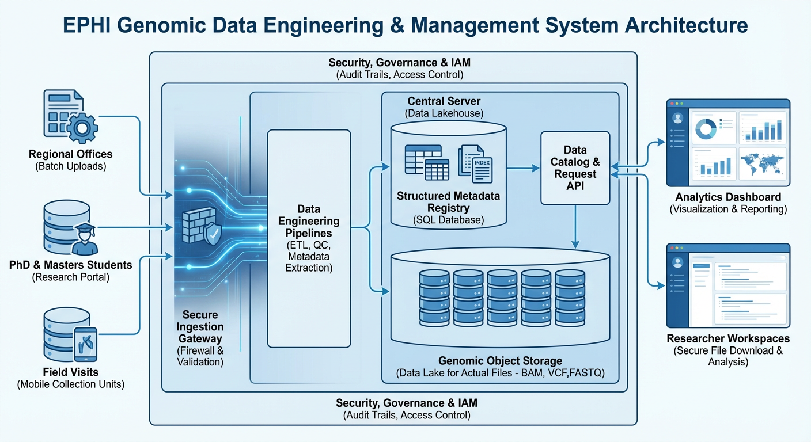
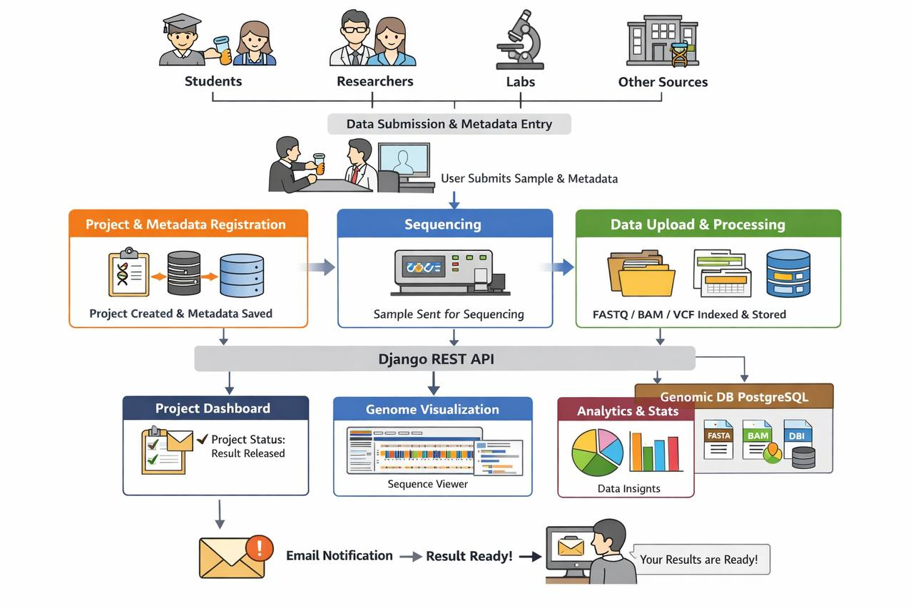

# Genomic Data Engineering Platform

## 📌 Overview
The **Genomic Data Engineering Platform** is a Django-based application designed to manage and streamline genomic research projects. It provides a structured way to track project submissions, approvals, metadata, and associated documentation. The system ensures transparency, accountability, and efficient collaboration between researchers, organizations, and regulatory bodies.

---

## 🚀 Features
- **Project Management**
  - Unique project identifiers
  - Titles, descriptions, and organizational details
  - Duration tracking and IRB codes

- **Submission Workflow**
  - Submission dates, sample submission dates
  - Automatic tracking of created and updated timestamps
  - Attachments and Memorandum of Understanding (MoU) files

- **Approval Process**
  - Approval by designated users
  - Metadata type association
  - Approval confirmation dates

- **User Integration**
  - Submitted by and approved by linked to Django’s `User` model
  - Role-based access control via Django’s authentication system

- **Status Tracking**
  - Project status linked to a dedicated `ProjectStatus` model
  - Metadata type linked to a `MetadataType` model

---
## 🏗️ Project Architecture

Core layers of the system are an ingest layer, a validation and de‑identification layer, a storage layer, a processing and catalog layer, and an access and presentation layer, all governed by consent, RBAC, encryption, and audit logging. Below is a detailed brief of each layer describing responsibilities, key components, and operational expectations. 



---

## 🔄 Workflow


Once a project is registered, the metadata is stored in a relational database while the physical sample is submitted to a sequencing facility. During the sequencing phase, the project status is tracked within the system to reflect its real-world progress. After sequencing is completed, the resulting genomic files (such as FASTA, BAM, or VCF) are uploaded into the platform by lab tech from EPHI, automatically indexed, and linked back to the original sample metadata without storing raw sequences in the database. Django, which is a Python web framework acts as the central orchestration layer, managing authentication, authorization, metadata persistence, file registration, and API access, while large genomic files are efficiently served from file storage using indexed, region-based access. Users can browse projects and samples through a hierarchical interface, visualize genomic regions directly in the browser using an embedded genome viewer, and explore analytical dashboards that show where data is stored, how it is distributed across projects, and how resources are being utilized. Once sequencing results are released, the system updates the project status to  “result released” and automatically notifies the submitting user via email, providing a transparent, traceable, and scalable workflow that integrates laboratory operations, data engineering, and user-facing genomic visualization into a single cohesive platform.



---

## 🛠 Tech Stack
- **Backend Framework**: Django (Python)
- **Database**: PostgreSQL / MySQL (configurable)
- **Authentication**: Django’s built-in `User` model
- **Admin Interface**: Django Admin for managing projects, statuses, and metadata
- **Version Control**: Git + GitHub

---


---

## ⚙️ Installation & Setup

## 1. **Clone the repository**
   ```bash
   git clone https://github.com/FrewLg/genomic-data-engineering.git
   cd genomic-data-engineering
  ``` 
## 2 Create a virtual environment

```bash
python -m venv venv
source venv/bin/activate   # Linux/Mac
venv\Scripts\activate      # Windows
``` 
## Install dependencies

```bash
pip install -r requirements.txt
``` 
## Apply migrations

```bash
python manage.py makemigrations
python manage.py migrate
``` 
## Create a superuser

```bash
python manage.py createsuperuser
``` 
## Run the development server

```bash
python manage.py runserver
``` 
## 📊 Database Models
```bash
Project
project_id (Primary Key, AutoField)

title (Unique, CharField)

description (TextField)

submission_date, created_date, updated_at

submitted_by (FK → User)

status (FK → ProjectStatus)

attachment, mou (CharField / FileField)

organization, duration

approved_by (FK → User)

metadata_type (FK → MetadataType)

irb_code (CharField)

approved_at, sample_submitted_at

ProjectStatus
id (Primary Key)

name (CharField)

MetadataType
id (Primary Key)

name (CharField)
``` 
## 🔒 Security & Compliance
Role-based access control ensures only authorized users can approve projects.

IRB codes and metadata types provide compliance with research standards.

Audit trail maintained via timestamps (created_date, updated_at, approved_at).

## 📈 Future Enhancements
File uploads for attachments and MoUs using Django’s FileField.

REST API endpoints for integration with external genomic data pipelines.

Advanced reporting and analytics dashboards.

Role-based permissions beyond Django’s default User model.

## 🤝 Contributing
- Fork the repository

- Create a feature branch (git checkout -b feature-name)

- Commit changes (git commit -m "Add feature")

- Push to branch (git push origin feature-name)

- Open a Pull Request

## 📜 License
This project is licensed under the MIT License. See the file for details.

## 👥 Authors
FrewLg – Initial development & repository setup

Contributors welcome!
 
---
 